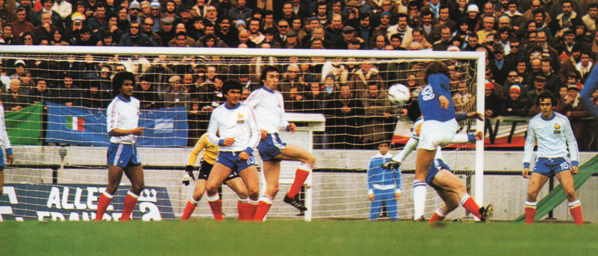

# La Europeización del Gol

Proyecto interactivo de scrollytelling que explora cómo la UEFA consolidó progresivamente su dominio en los goles de los Mundiales de la FIFA a lo largo del tiempo.

## Descripción

Este proyecto fue desarrollado como parte de un trabajo universitario de visualización de datos enfocado en el aprendizaje de narrativa interactiva y comunicación visual utilizando Flourish.

Partiendo de una hipótesis inicial —que la ventaja histórica temprana de CONMEBOL sería eventualmente superada por UEFA— analizamos datos de goles en Copas del Mundo entre 1930 y 2022 mediante distintas visualizaciones y secciones narrativas.

A medida que avanzó el análisis, los propios datos desafiaron parcialmente nuestra hipótesis original, permitiéndonos reflexionar sobre cómo se representan el dominio, la distribución y las ventajas estructurales en la historia del fútbol mundial.

## Objetivos

- Explorar técnicas de data storytelling
- Construir una experiencia sencilla de scrollytelling
- Aprender flujos de trabajo de visualización interactiva con Flourish
- Analizar tendencias históricas de goles en los Mundiales
- Combinar visualización de datos con diseño web editorial

## Tecnologías utilizadas

- HTML5
- CSS3
- Flourish
- Google Sheets

## Fuente de datos

Dataset proporcionado por los profesores de la materia utilizando estadísticas históricas oficiales de FIFA como fuente principal.

## Contenido del proyecto

1. Mapa global de distribución de goles
2. Evolución temporal del dominio por confederación
3. Acumulado histórico de goles por país
4. Factores estructurales y expansión del torneo
5. Diversidad goleadora entre confederaciones
6. Panorama histórico actual

## Mi participación

Trabajo realizado de manera grupal en:
- Construcción de visualizaciones
- Desarrollo narrativo
- Implementación en HTML y CSS
- Estructura de storytelling
- Decisiones de diseño visual y editorial

## Aprendizajes

Este proyecto me permitió desarrollar experiencia en:
- Data storytelling
- Diseño de visualizaciones interactivas
- Estructuras de scrollytelling
- Transformación de datos en narrativas
- Maquetado y estilos front-end
- Trabajo colaborativo en productos digitales

## Demo

[Ver proyecto](https://fededelcuadro.github.io/europeizacion-del-gol/)
